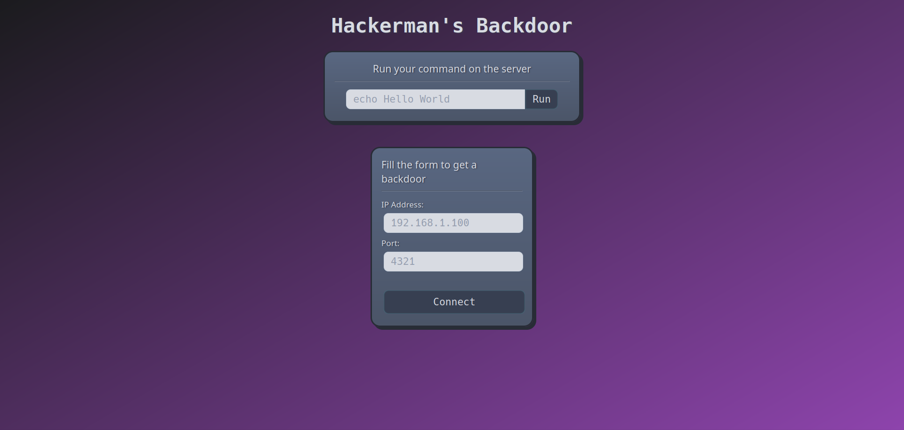
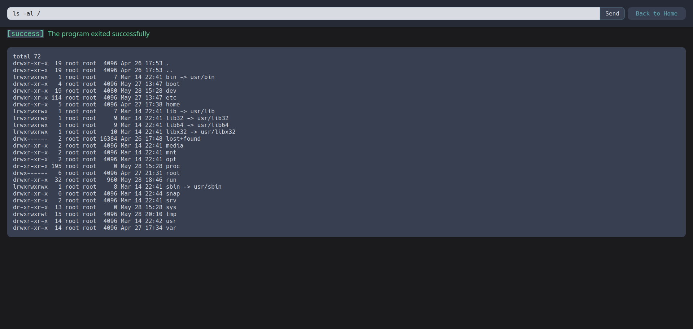

# Introduction

This is a very simple Java server program that can be deployed on a Tomcat server to spawn a remote shell on a target machine.

I am not an expert in Java nor Tomcat, so everything is kind of a mess.


# Installation
Make sure maven is correctly installed on your system.

Compile the project with
```bash
mvn clean package
```

The output will be a `.war` file in the `target` folder.

Copy the generated `.war` file to the webapps folder of your Tomcat server or deploy it using the Tomcat manager.

# Usage
The program will show a sophisticated web interface that allows you to spawn a remote shell on the target machine or to run any command you wish.




# Disclaimer
This program is for educational purposes only. I am not responsible for any damage you cause with it.

# License
This project is licensed under the MIT License - see the [LICENSE](LICENSE) file for details

# Authors
* [Claudio Cicimurri](https://github.com/Cicim) (@Cicim)
* [Andrea Cicimurri](https://github.com/Affixatticus) (@Affixatticus)
